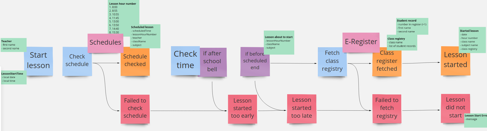

# E-Lesson (functional DDD showcase)

## Exercise #9: Async effect

A communication with external dependencies may sometimes require asynchronous access. 
In this exercise we will introduce another effect which helps to model such communication.

### Exercise description

Bearing in mind external dependencies (pink blocks) on the below diagram, please introduce async result.

- Go to [CurrentLesson.kt](src/main/kotlin/com/krzykrucz/elesson/currentlesson/domain/CurrentLesson.kt)
- Change return type of dependencies to `AsyncResult` from `base-types-kt` library
- Make tests pass
    
#### Tips

- `AsyncResult` should be composable 
- It will have effect on the whole workflow