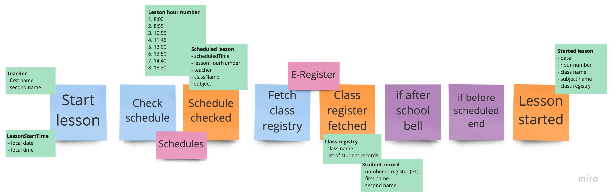

# E-Lesson (functional DDD showcase)

## Exercise #4: Sum types

In this exercise, we will focus on modeling with Sum types.

### Exercise description

Based on this Event Storming fragment:

- Go to [CurrentLesson.kt](src/main/kotlin/com/krzykrucz/elesson/currentlesson/domain/CurrentLesson.kt)
- Implement `LessonHourNumber` and `ScheduledLesson` as Sum types

