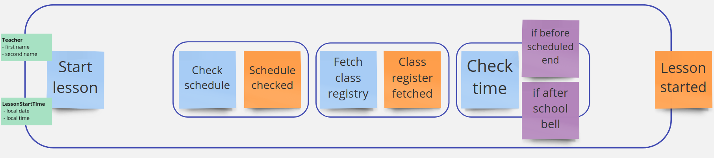

# E-Lesson (functional DDD showcase)

## Exercise #10: Publishing events

As we discovered Domain Events, it will worth letting know about them to other contexts.

In this exercise we will publish events as an output of our workflow.

### Exercise description

Based on this Event Storming fragment:

- Go to [CurrentLesson.kt](src/main/kotlin/com/krzykrucz/elesson/currentlesson/domain/CurrentLesson.kt)
- Extend `LessonStartedEvent` to cover required data
- Return domain event from the workflow
- Provide publishing function as a dependency
- Make tests pass

#### Tips

- Prefer events as an output from the whole workflow
- Focus only on really necessary events
- Avoid events within bounded context
- Avoid internal listeners which may hide some mutable state!