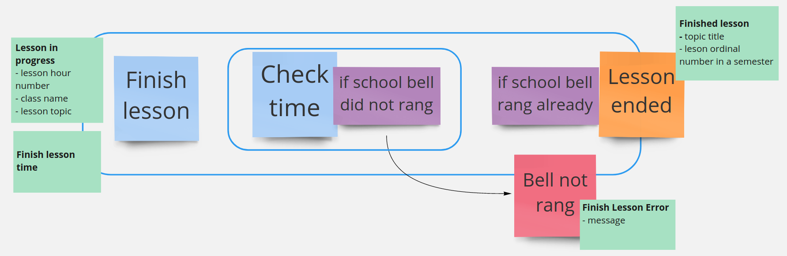

# E-Lesson (functional DDD showcase)

## Exercise #12: Finish Lesson feature

Congrats! We have covered many building blocks which allows to implement your business requirements in the functional style.

It is time to cover completely new feature. This exercise is focused on the `Finish lesson` feature implementation from the scratch.

### Exercise description

Based on this Event Storming fragment:

implement `Finish lesson` feature by:

- Writing `Gherkin` specification
- Adding `Cucumber` test
- Finding and defining required types
- Defining workflow and its dependencies
- Publishing output event
- Handling errors properly
- Adding REST adapter to finish lesson 

#### Tips

- Start from tests!
- Ask domain expert
- Prefer incremental approach
- Review previous feature for inspiration