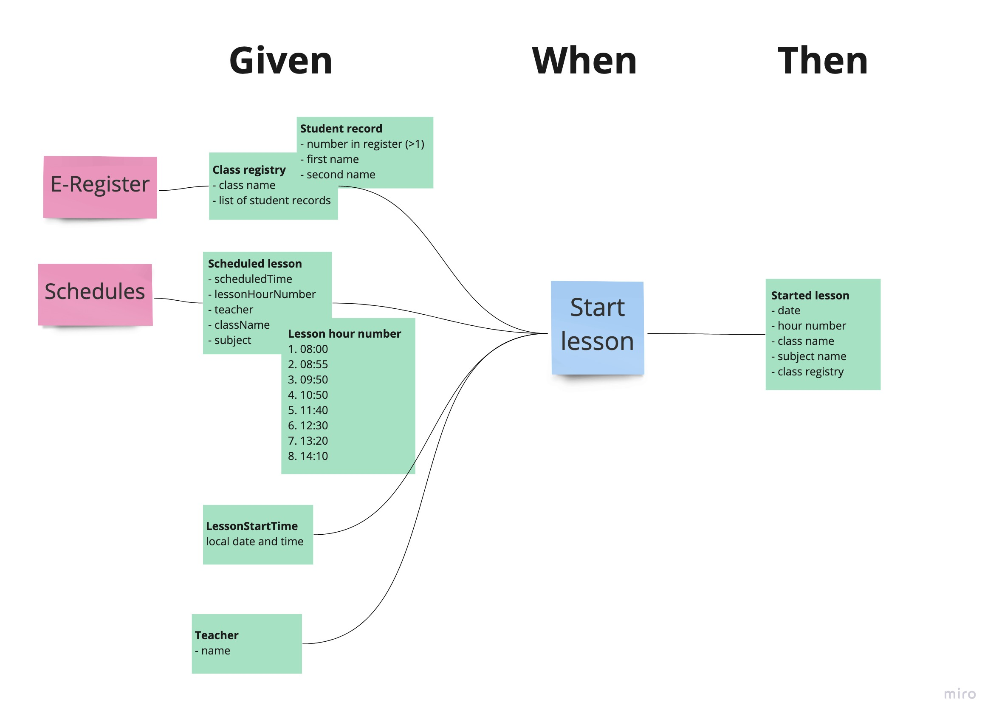

# E-Lesson (functional DDD showcase)

## Exercise #1: Specification by example

Let's dig in to the first step of transferring results of Event Storming into code.

We will start with writing behavior description of Started Lesson workflow using Gherkin notation.

Here are some examples of using it: https://docs.behat.org/en/v2.5/guides/1.gherkin.html

### Exercise description

Based on this Event Storming fragment:

- Go to [StartLesson.feature](src/test/resources/com/krzykrucz/elesson/currentlesson/domain/StartLesson.feature)
- Create `Scenario Outline` based on events above
- Focus on happy path only

#### Tips
1. When in doubt - ask domain expert.

2. The only thing you have to do is to write a Scenario, no implementation required.

3. Make sure to notice the purple stickies.

4. You may notice that `Check Schedule` and `Fetch Class Registry` commands are talking to external systems, ignore that fact for know and assume you have correct data already.

5. This image may clarify it a bit ;)

