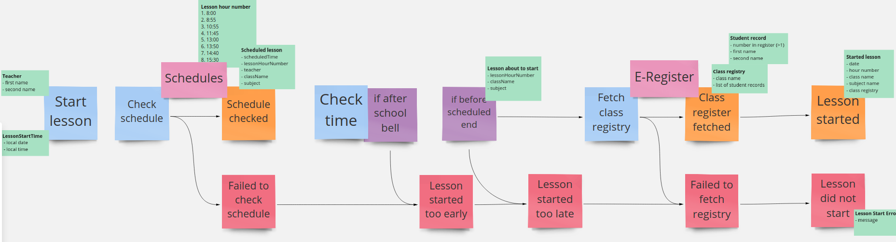

# E-Lesson (functional DDD showcase)

## Exercise #8: Error Effects 

Not every path is happy. In this exercise we will make our workflows aware of errors. 

### Exercise description

Based on this Event Storming fragment:

- Go to [CurrentLesson.kt](src/main/kotlin/com/krzykrucz/elesson/currentlesson/domain/CurrentLesson.kt)
- Introduce `Result` effect from `base-types-kt` library to cover errors
- Use error types like presented in storming
- Make tests pass

#### Tips

- Make errors explicit