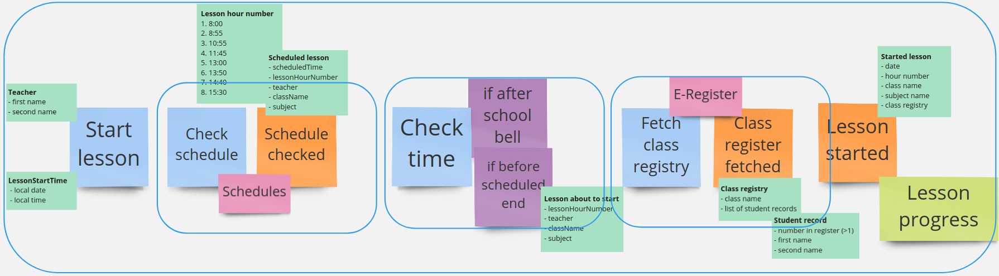

# E-Lesson (functional DDD showcase)

## Exercise #7: Explicit dependencies

This exercise is focused on a proper workflow implementation with dependencies.

### Exercise description

Based on this Event Storming fragment:

- Go to [CurrentLesson.kt](src/main/kotlin/com/krzykrucz/elesson/currentlesson/domain/CurrentLesson.kt)
- Implement `StartLessonWithDependencies` providing required dependencies of `CheckSchedule` and `FetchClassRegistry`
- Change `startLesson` so that dependencies are not implicit

#### Tips

- Be explicit!
- Take a look at Event Storming to grasp where dependencies are
- Provide dependencies as parameters
- Currying is your friend